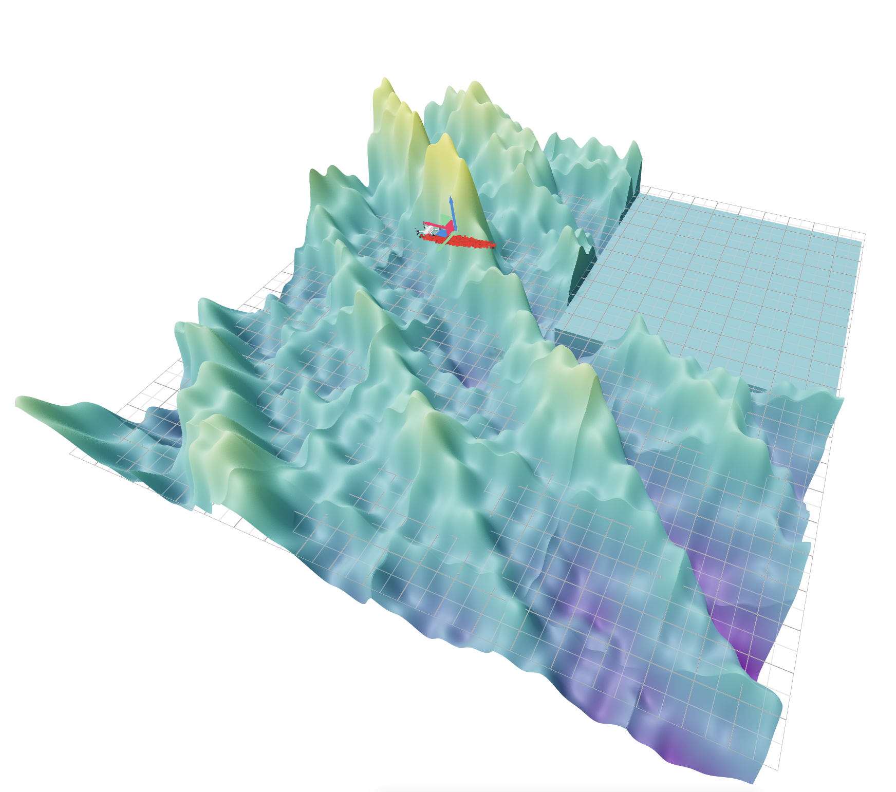

# CS 4750 Filter Demonstrations

## Problem setup
This demo shows how different state estimators we discussed in class perform for a difficult drone localization problem. We model the drone point mass in 2D, flying at a constant height, which gets height measurements from a noisy altimeter.

The drone's state is its position and velocity in 2D, $\mathbf{x} = [p\_x, p\_y, v\_x, v\_y]^T$. Its dynamics are a discrete-time version of $\mathbf{f} = m\mathbf{a}$ with a time step of $\Delta t$,

$$\mathbf{x}_{k+1} = \begin{bmatrix} 1 & 0 & \Delta t & 0 \\ 0 & 1 & 0 & \Delta t \\ 0 & 0 & 1 & 0 \\ 0 & 0 & 0 & 1 \end{bmatrix} \mathbf{x}_{k} + \begin{bmatrix} 0 & 0 \\ 0 & 0 \\ 1 & 0 \\ 0 & 1 \end{bmatrix} \mathbf{u}_{k} + \epsilon_{k},$$

where $\epsilon\_{k} \sim \mathcal{N}(\mathbf{0}, \mathbf{Q})$ is process noise with covariance $\mathbf{Q} = 0.01 * \mathbf{I}$.

At each point $\mathbf{p} = [p\_x, p\_y]^T$, the drone receives a noisy height measurement from an altimeter:
$$z\\_{k} = h(\mathbf{p}\\_{k}) + \delta\\_{k},$$
where $h$ is a nonlinear terrain function defined with sines and cosines, along with a flat section in to the southeast. The noise has a variance $Q = 0.05$. The terrain function is shown in the screenshot below.

This problem is highly ambiguous - many different positions correspond to the same height measurement, especially in the flat region of the terrain. 

The drone applies a control input $\mathbf{u}\_{k} = -K\_p * (\bar{\mathbf{p}}\_{k} - \mathbf{p}\_\text{des})$ tries to fly toward a desired position $\mathbf{p}\_\text{des}$, where $\bar{\mathbf{p}}\_{k}$ is the estimated position at time $k$ and $K\_p = 0.2$ is a proportional gain.

### Visualization details
Each of the visualizations below will show an animation of the drone flying and show samples from the estimator's belief about the drone's position as a point cloud. The color of each point corresponds to how likely the current measurement is given that position (i.e., the likelihood of the measurement under the altimeter model at that position). The desired position is shown by a coordinate frame.

## Demonstrations - Extended Kalman Filter (EKF)

### Nominal case
[Here](https://pculbertson.github.io/filter-demos/viser-client/?playbackPath=https://pculbertson.github.io/filter-demos/recordings/ekf_nominal.viser&initialCameraPosition=4.100,10.520,13.791&initialCameraLookAt=0.000,0.000,0.000&initialCameraUp=-0.000,0.000,1.000) you can find a 3D view of the EKF when the desired position is in a "bumpy" (identifiable) region of the terrain. The interactive visualization below may take a couple seconds to load.

We notice that the EKF can "hang on" for a few seconds, but quickly diverges - this is because the terrain is highly curved, so the linearizations used to update the belief are very inaccurate.

<iframe
  src="https://pculbertson.github.io/filter-demos/viser-client/?playbackPath=https://pculbertson.github.io/filter-demos/recordings/ekf_nominal.viser&initialCameraPosition=4.100,10.520,13.791&initialCameraLookAt=0.000,0.000,0.000&initialCameraUp=-0.000,0.000,1.000"
  width="800"
  height="600"
  style="border: none; border-radius: 8px;"
  allowfullscreen
></iframe>

### Ambiguous case
[Here](https://pculbertson.github.io/filter-demos/viser-client/?playbackPath=https://pculbertson.github.io/filter-demos/recordings/ekf_flat.viser&initialCameraPosition=4.100,10.520,13.791&initialCameraLookAt=0.000,0.000,0.000&initialCameraUp=-0.000,0.000,1.000) you can find a 3D view of the EKF when the goal is in the flat region of the terrain. Here, the EKF covariance quickly spreads out and diverges. This is because the linearization of the measurement model in this region provides no information about the drone's position.

<iframe
  src="https://pculbertson.github.io/filter-demos/viser-client/?playbackPath=https://pculbertson.github.io/filter-demos/recordings/ekf_flat.viser&initialCameraPosition=4.100,10.520,13.791&initialCameraLookAt=0.000,0.000,0.000&initialCameraUp=-0.000,0.000,1.000"
  width="800"
  height="600"
  style="border: none; border-radius: 8px;"
  allowfullscreen
></iframe>

## Demonstrations - Particle Filter (PF)

The particle filter attempts to represent our belief using "particles" - a weighted set of samples/hypotheses that we want to match the true posterior, $\textrm{bel}(\mathbf{x}\_t) = \{(w\_t^1, \mathbf{x}\_t^1), \ldots, (w\_t^N, \mathbf{x}\_t^N)\}$. The particle filter steps are illustrated in the animation below:

1. **Prediction**: Each particle is propagated through the dynamics model, adding process noise. $$ \mathbf{x}_t^i \sim p(\mathbf{x}_t \mid \mathbf{u}_t, \mathbf{x}_{t-1}^i).$$

2. **Update**: Each particle's weight is updated according to the measurement likelihood. $$ w_t^i = p(z_t \mid \mathbf{x}_t^i).$$

3. **Normalization**: The weights are normalized to sum to 1. $$ w_t^i = \frac{w_t^i}{\sum_{j=1}^N w_t^j}.$$

4. **Resampling**: Particles are resampled to create a new particle set whose equally-weighted locations matches the weighted set from the previous step. For each particle $k$, we resample a new particle index $i$ using $$ i^{(k)} \sim \textrm{Categorical}(w_t^1, \ldots, w_t^N) $$ and set the new particle to be at the same location as the sampled particle, $$ (w_t^k, \mathbf{x}_t^{(k)}) = (\frac{1}{N}, \mathbf{x}_t^{i^{(k)}}). $$

<iframe
  src="https://pculbertson.github.io/viser-client/?playbackPath=https://pculbertson.github.io/recordings/pf_steps.viser&initialCameraPosition=1.762,1.284,6.750&initialCameraLookAt=-0.745,-2.293,1.971&initialCameraUp=-0.000,0.000,1.000"
  width="800"
  height="600"
  style="border: none; border-radius: 8px;"
  allowfullscreen
></iframe>

### Nominal case
[Here](https://pculbertson.github.io/filter-demos/viser-client/?playbackPath=https://pculbertson.github.io/filter-demos/recordings/pf_nominal.viser&initialCameraPosition=4.100,10.520,13.791&initialCameraLookAt=0.000,0.000,0.000&initialCameraUp=-0.000,0.000,1.000) you can find a 3D view of the Particle Filter when the desired position is in a "bumpy" (identifiable) region of the terrain. The particle filter uses 10k particles.

We notice that the Particle Filter is able to maintain a highly multimodal belief about the drone's position, and is often able to recover from "bad" beliefs. Notice how the particles spread around "rings" of possible positions that correspond to the same height measurement.

<iframe
  src="https://pculbertson.github.io/filter-demos/viser-client/?playbackPath=https://pculbertson.github.io/filter-demos/recordings/pf_nominal.viser&initialCameraPosition=4.100,10.520,13.791&initialCameraLookAt=0.000,0.000,0.000&initialCameraUp=-0.000,0.000,1.000"
  width="800"
  height="600"
  style="border: none; border-radius: 8px;"
  allowfullscreen
></iframe>

### Ambiguous case
[Here](https://pculbertson.github.io/filter-demos/viser-client/?playbackPath=https://pculbertson.github.io/filter-demos/recordings/pf_flat.viser&initialCameraPosition=4.100,10.520,13.791&initialCameraLookAt=0.000,0.000,0.000&initialCameraUp=-0.000,0.000,1.000) you can find a 3D view of the Particle Filter when the goal is in the flat region of the terrain. Here, the Particle Filter is still able to maintain a good belief about the drone's position, although the uncertainty grows larger (becoming almost uniform) in the flat region. Whenever the drone leaves the flat region, the filter is able to quickly re-localize, as the terrain outside this region is highly informative.

<iframe
  src="https://pculbertson.github.io/filter-demos/viser-client/?playbackPath=https://pculbertson.github.io/filter-demos/recordings/pf_flat.viser&initialCameraPosition=4.100,10.520,13.791&initialCameraLookAt=0.000,0.000,0.000&initialCameraUp=-0.000,0.000,1.000"
  width="800"
  height="600"
  style="border: none; border-radius: 8px;"
  allowfullscreen
></iframe>

## Discussion
This example is adversarial for the EKF in two ways: the terrain is highly nonlinear, and the measurement model is highly ambiguous. The EKF's linearizations are not able to capture the true posterior distribution over the drone's position, leading to filter divergence. In contrast, the Particle Filter is able to maintain a highly multimodal belief about the drone's position, allowing it to successfully localize the drone even in this difficult scenario.

## Implementation details

All filters are implemented in [jax](https://github.com/google/jax), a package for high-performance numerical computing in Python. All Jacobians can be computed using the automatic differentiation features of jax, and particle filter updates can be efficiently vectorized over all particles. Visualizations are created using [viser](https://viser.studio), an excellent package for web-based 3D visualization.